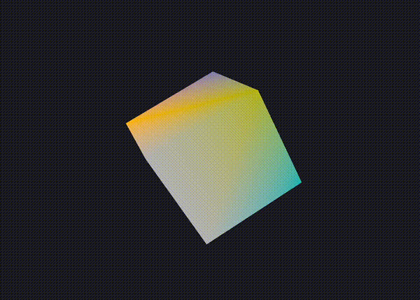

# Mjolnir Engine

Mjolnir is a rendering engine based on Vulkan API.
This repository features a Vulkan binding for [C3 language](https://c3-lang.org). On the details of how to include this library in your project, see [vulkan.c3l](./lib/vulkan.c3l/README.md)



# Installation

## Manual

To build example program we need
- [C3](https://c3-lang.org)
- [GLFW](https://www.glfw.org)
- [Vulkan SDK](https://vulkan.lunarg.com/sdk/home)

If you are on Arch Linux you can install them all using
```sh
sudo pacman -S c3c glfw vulkan-devel
```

## Nix

Alternately you can use [Nix](https://nixos.org) to simplify
the installation process and keep your system clean. *On Mac there is still a need to install Vulkan SDK manually.*
After install Nix, run the following command to enter development environment
```sh
nix develop
```

# Running

First compile GLSL shader to SPIRV if you haven't done so
```sh
glslc -c src/mj/material/shaders/pbr.frag -o src/mj/material/shaders/pbr.frag.spv
glslc -c src/mj/material/shaders/pbr.vert -o src/mj/material/shaders/pbr.vert.spv
```
Simply run `c3c run` to run the program.

# Work in progress

This is a work in progress. Functions are supposed to break frequently.
